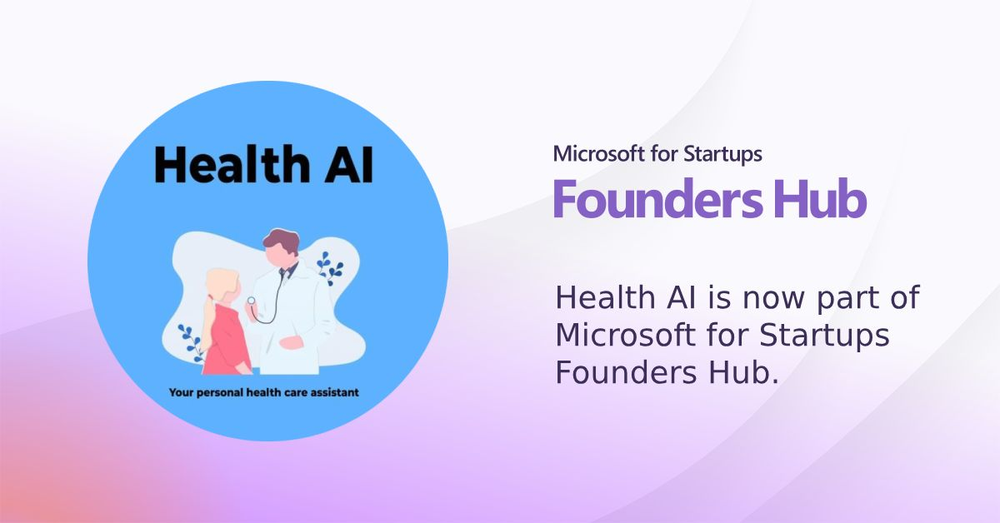
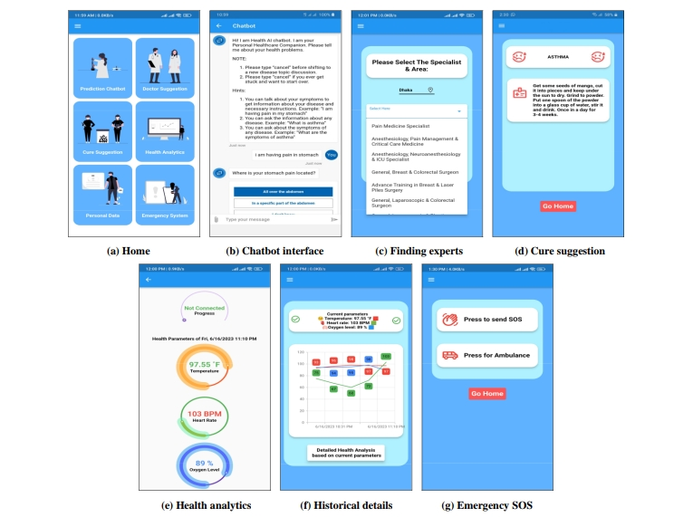

# Health-AI
### A Personal Healthcare Companion App

We are thrilled to announce that, after 1 year of planning, development, and testing, our app **Health AI: A Personal Healthcare Companion** is officially in the Beta release phase!

### Watch the Demo on YouTube:
[Watch Here](https://lnkd.in/gmRtcERr)

---

### Features

**1. Health AI Chatbot**
- **1.1** Chat with Health AI to discuss symptoms and receive predictions on possible diseases, along with care suggestions.
- **1.2** Access information about various diseases and symptoms.

**2. Doctor Suggestion Module**
- **2.1** Find domain-specific specialists and their contact information in a particular region.

**3. Cure Suggestion Module**
- **3.1** Discover home remedies for various diseases.

**4. Health Analytics Module**
- **4.1** Measure health metrics such as heart rate, oxygen level, and temperature (requires hardware device).
- **4.2** Visualize health data with graphs and receive feedback on collected health information.

**5. SOS Module**
- **5.1** Send current location and an SOS message to saved contacts in case of an emergency.
- **5.2** Locate the nearest hospital and share the current location with the hospital to request ambulance services in an emergency.

---

### Tools Used
- **Frontend**: Flutter
- **Database**: Firebase
- **AI Services**: Microsoft Azure

---

### Our Team
- **Jamal Uddin Tanvin**
- **MD Rifat Islam**
- **Md Tausiful Haque**
- **Nurshat Fateh Ali**

---

### For Detailed SRS, Evaluation Report, and Poster Presentation
[Access Documents Here](https://drive.google.com/drive/folders/14gCObKJ2Yv035-dUbye9Di-Sf9uKWvCA)

---

### For Business Collaborations
- **Email**: [nurshatfateh@gmail.com](mailto:nurshatfateh@gmail.com)
- **Email**: [rifat010bushra@gmail.com](mailto:rifat010bushra@gmail.com)

